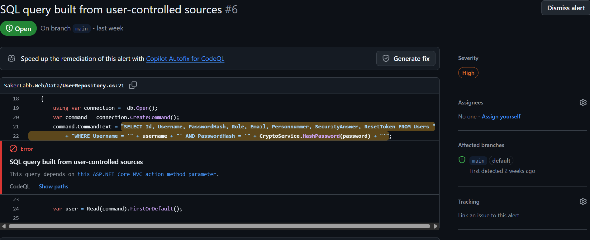
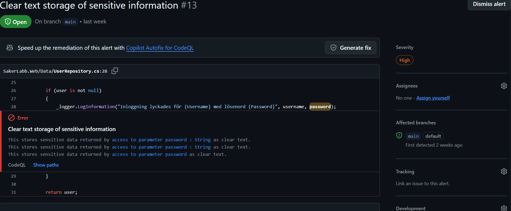
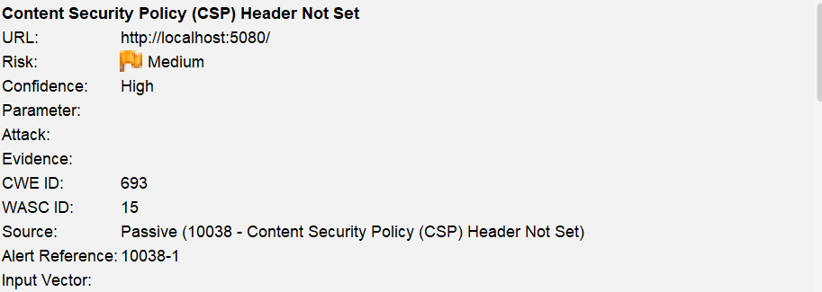
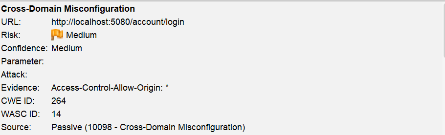
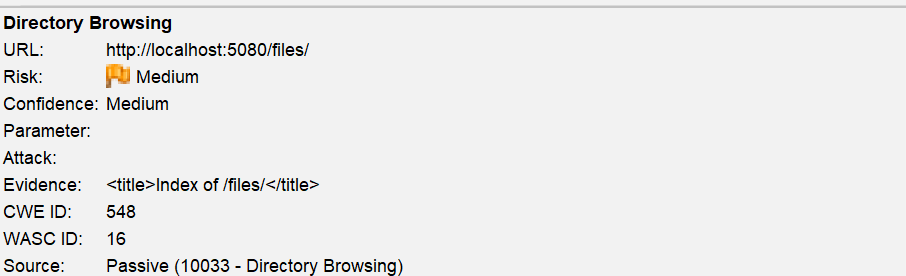
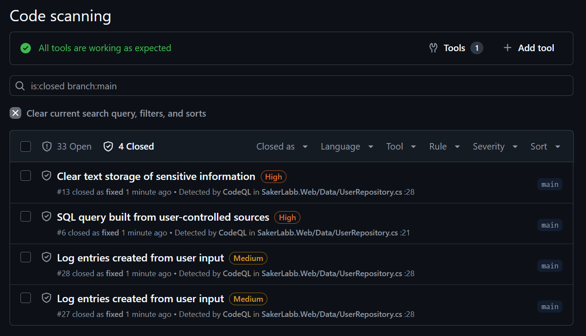
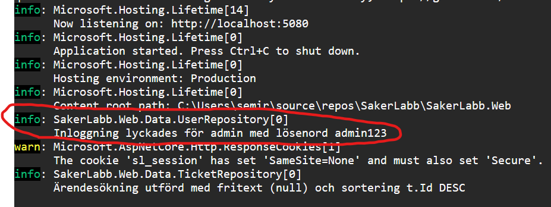
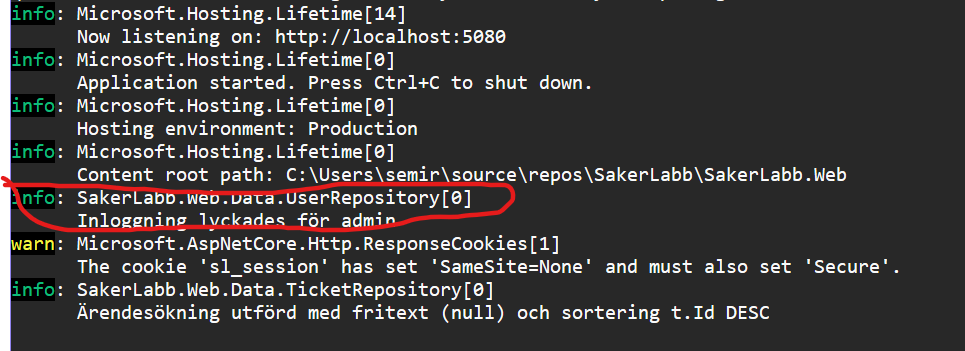

# Labbrapport: praktisk laboration

*Kunskapskontroll 2, IT-säkerhet för utvecklare. Fyll i mallen och lämna in som PDF tillsammans med länken till ditt repo. Riktlängd två till tre sidor.*

**Namn: Semir Zahirovic**
**Datum:2026-09-01**
**Repo (länk till din fork):https://github.com/SemirZahirovic97/SakerLabb**
**Applikation som analyserades:SakerLabb Support**

---

## 1. Kort om applikationen och analysen

Beskriv i några meningar vilken app du analyserade, vad den gör och hur du genomförde analysen. Ange vilka verktyg du använde och hur du körde dem (CodeQL default setup med språk C#, ZAP passiv och aktiv skanning mot vilken adress).

*SakerLabb Support hanterar supportärenden, kommentarer, användarkonton och filbilagor, och är framtagen som en medvetet sårbar labbmiljö för den här kursen. Den statiska analysen genomfördes med CodeQL via GitHub:s "default setup" för språket C#, aktiverat på min egen fork av repot. Den dynamiska analysen genomfördes med OWASP ZAP mot applikationen körande lokalt på http://localhost:5080, med både spider/passiv skanning och en aktiv skanning via Quick Start.*

---

## 2. Fem fynd

Fyll i tabellen. Minst ett fynd ska komma från statisk analys (CodeQL) och minst ett från dynamisk analys (ZAP). Spara bevis i form av skärmbild eller rapportutdrag och hänvisa till det per fynd.

| Nr | Källa (CodeQL/ZAP) | Regel-id eller alert | Allvarlighet (+ confidence för ZAP) | Fil och rad eller URL | Verkligt eller falskt positivt | Motivering (2–4 meningar) |
|----|--------------------|----------------------|-------------------------------------|-----------------------|--------------------------------|---------------------------|
| 1 | CodeQL | SQL query built from user-controlled sources | High | SakerLabb.Web/Data/UserRepository.cs:21 (Authenticate) | Verkligt | Frågan byggs med strängkonkatenering av användarnamn och lösenordshash. Jag verifierade det själv genom att logga in med ' OR '1'='1' -- som användarnamn, vilket loggade in mig utan känt lösenord. |
| 2 | CodeQL | Clear text storage of sensitive information | High |	SakerLabb.Web/Data/UserRepository.cs:28 | Verkligt | Vid lyckad inloggning loggades det riktiga lösenordet i klartext till applikationens loggar. Bekräftat genom att titta i terminalutskriften vid inloggning. |
| 3 | ZAP | Content Security Policy (CSP) Header Not Set (Systemic) | Medium, confidence High | http://localhost:5080/ | Verkligt | Applikationen sätter ingen CSP-header, vilket gör att webbläsaren inte begränsar vilka skript/resurser som får laddas om en XSS-sårbarhet skulle utnyttjas. Larmet är märkt "Systemic", dvs. gäller genomgående på hela sajten. |
| 4 | ZAP | Cross-Domain Misconfiguration | Medium, confidence Medium | POST http://localhost:5080/account/login | Verkligt | CORS-policyn i Program.cs tillåter alla origins (AllowAnyOrigin), även på inloggningsendpointen som hanterar lösenord och sätter sessionscookie. |
| 5 | ZAP | Directory Browsing | Medium, confidence Medium | http://localhost:5080/files/ | Verkligt | /files-katalogen hade filförteckning aktiverad, vilket lät vem som helst bläddra och se alla bilagor utan att känna till filnamnen. Bekräftat genom att surfa till adressen och se en fullständig fillista. |

Bevis (skärmbilder eller utdrag), numrerade efter fyndet ovan:

**Bevis fynd 1 (SQL-injektion):**


**Bevis fynd 2 (Klartextloggning):**


**Bevis fynd 3 (CSP header):**


**Bevis fynd 4 (CORS):**


**Bevis fynd 5 (Directory Browsing):**


---

## 3. Prioritering

Rangordna fynden och motivera ordningen med allvarlighetsgrad, exponering och utnyttjbarhet. Vilket tar du först och varför?

*Jag prioriterade fynden efter en kombination av allvarlighetsgrad, hur lätt de går att nå och hur enkla de är att utnyttja i praktiken. SQL-injektionen (fynd 1) tar jag först den kräver ingen autentisering alls och ger direkt åtkomst till att kringgå inloggningen, vilket gör den till den mest kritiska. Klartextloggningen av lösenord (fynd 2) kommer därnäst; den är också allvarlig eftersom lösenord ofta återanvänds mellan tjänster, men kräver att någon redan har åtkomst till loggarna, vilket gör exponeringen något lägre. Cross-Domain Misconfiguration (fynd 4) prioriterar jag före Directory Browsing (fynd 5) eftersom den påverkar en känsligare endpoint (inloggning). CSP-headern (fynd 3) hamnar sist eftersom den inte är en sårbarhet i sig, utan ett extra skydd som bara gör nytta om något annat redan gått fel, till exempel en XSS-attack. Utan en sådan attack att skydda mot gör den saknade headern ingen omedelbar skada.*

---

## 4. Åtgärder (minst tre)

Använd mönstret nedan per åtgärdat fynd. Varje åtgärd ska gå att spåra tillbaka till ett fynd i tabellen ovan, och beviset efter ska vara en **ny körning av verktyget**, inte din egen kod.

### Åtgärd 1

```
Fynd:        Nr 1, SQL query built from user-controlled sources
Plats:       SakerLabb.Web/Data/UserRepository.cs, rad 21 (Authenticate)
Bevis före:  se bild nedan
Bedömning:   Verkligt. Verifierat genom eget test: inloggning med användarnamnet
             ' OR '1'='1' -- loggade in utan känt lösenord innan fixen.
Åtgärd:      Bytte strängkonkatenerad SQL-fråga mot en parametriserad fråga med
             SqliteCommand.Parameters. Commit 4a2bc34.
Bevis efter: se bild nedan. CodeQL-alert #6 visar Closed as fixed efter ny
             körning.
```



### Åtgärd 2

```
Fynd:        Nr 2, Clear text storage of sensitive information
Plats:       SakerLabb.Web/Data/UserRepository.cs, rad 28
Bevis före:  se bilder nedan
Bedömning:   Verkligt. Lösenordet syntes i klartext i terminalens loggutskrift
             vid varje lyckad inloggning.
Åtgärd:      Tog bort lösenordsparametern ur loggmeddelandet, loggar nu bara
             användarnamnet. Commit 4ca381f.
Bevis efter: se bilder nedan. CodeQL-alert #13 visar Closed as fixed efter ny
             körning.
```




### Åtgärd 3

```
Fynd:        Nr 5, Directory Browsing
Plats:       SakerLabb.Web/Program.cs (UseDirectoryBrowser-blocket)
Bevis före:  se bild och bilagd rapport nedan
Bedömning:   Verkligt. Bekräftat genom att surfa till /files/ och se en
             fullständig fillista.
Åtgärd:      Tog bort UseDirectoryBrowser-konfigurationen, behöll
             UseStaticFiles så nedladdning av kända filnamn fortfarande
             fungerar. Commit b4ac7d7.
Bevis efter: se bilagd rapport nedan. Ny ZAP-skanning visar att larmet inte
             längre finns med.
```


[Fullständig ZAP-rapport fore atgard](bevis/zap-rapport-fore-atgard.html)
[Fullständig ZAP-rapport efter atgard](bevis/zap-rapport-efter-atgard.html)

---

## 5. Eventuella bortval

Om du valt att inte åtgärda ett fynd, skriv ned tre saker per bortval: risken, motivet och den kompenserande kontrollen. Sätt gärna ett datum för omprövning.

*Content Security Policy (CSP) Header Not Set.
Risk: utan CSP saknar webbläsaren ett extra skyddslager mot skadliga skript om en XSS-sårbarhet någon gång skulle utnyttjas i appen. Motiv för bortval:appen körs just nu bara lokalt i en labbmiljö utan riktiga användare eller känslig extern trafik samt att det kändes lite för invecklat så jag valde lättare åtgärder.Kompenserande kontroll: inga externa användare har åtkomst till instansen.

Cross-Domain Misconfiguration (CORS, AllowAnyOrigin).
Risk: en skadlig webbplats skulle kunna göra anrop mot appens endpoints, inklusive inloggningen, från vilken origin som helst. Motiv för bortval: appen har idag ingen egen separat frontend på en annan origin som behöver CORS samt att även denna kändes invecklad och lite svårare att åtgärda. Kompenserande kontroll: appen är endast nåbar på localhost under labbmiljön, ingen extern klient interagerar med den i praktiken.*
